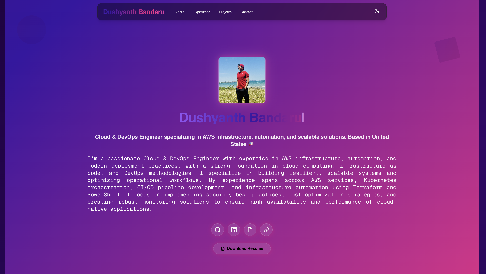

# 🚀 Dushyanth Bandaru - Cloud & DevOps Portfolio


<div align="center">
  
</div>

<div align="center">


**Modern, Responsive Portfolio Showcasing Cloud & DevOps Expertise**

[🌐 Live Demo](https://dushyanth-portfolio.com) • [📧 Contact](mailto:dushbanda99@gmail.com) • [💼 LinkedIn](https://www.linkedin.com/in/dushyanthbandaru/)

</div>

---

## ✨ **Portfolio Highlights**

### 🎨 **Modern Design & UX**
- **Glassmorphism Effects** - Beautiful frosted glass UI components
- **Animated Gradients** - Dynamic background animations with CSS
- **Smooth Transitions** - Framer Motion powered animations
- **Dark Theme** - Professional dark mode with theme switching
- **Responsive Design** - Perfect on all devices (mobile, tablet, desktop)

### 🛠 **Technical Excellence**
- **Next.js 14** - Latest App Router with server-side rendering
- **TypeScript** - Type-safe development with strict configurations
- **Tailwind CSS** - Utility-first styling with custom animations
- **Framer Motion** - Advanced animations and micro-interactions
- **Resend API** - Real-time contact form with email delivery

### 📱 **Interactive Features**
- **Contact Form** - Functional form with email notifications
- **Project Showcase** - Detailed project cards with live links
- **Experience Timeline** - Animated career progression display
- **Download Resume** - Direct PDF download functionality
- **Social Links** - Integrated GitHub, LinkedIn, and CV links

---

## 🏗 **Architecture & Tech Stack**

### **Frontend Framework**
```typescript
Next.js 14.2.28 (App Router)
├── React 18.3.1
├── TypeScript 5.5.4
└── Tailwind CSS 3.4.17
```

### **UI & Animation Libraries**
```typescript
Framer Motion 12.10.4
├── Page transitions
├── Component animations
└── Micro-interactions

Radix UI Components
├── Accessible components
├── Theme provider
└── Toast notifications
```

### **Backend & APIs**
```typescript
Next.js API Routes
├── Contact form handler
├── Resend email integration
└── Environment variables
```

### **Development Tools**
```typescript
ESLint + Prettier
├── Code quality
├── Type checking
└── Formatting

Vercel Analytics
├── Performance monitoring
└── Speed insights
```

---

## 🚀 **Getting Started**

### **Prerequisites**
- Node.js 18+ 
- npm or yarn
- Git

### **Installation**
```bash
# Clone the repository
git clone https://github.com/dushf12/Dush_Portfolio.git

# Navigate to project directory
cd Dush_Portfolio

# Install dependencies
npm install

# Set up environment variables
cp .env.example .env.local
# Add your Resend API key to .env.local

# Run development server
npm run dev
```

### **Environment Variables**
```env
# .env.local
RESEND_API_KEY=your_resend_api_key_here
```

### **Available Scripts**
```bash
npm run dev          # Start development server
npm run build        # Build for production
npm run start        # Start production server
npm run lint         # Run ESLint
```

---

## 📁 **Project Structure**

```
src/
├── app/                    # Next.js App Router
│   ├── api/               # API routes
│   ├── career/            # Experience page
│   ├── contact/           # Contact page
│   ├── projects/          # Projects page
│   └── layout.tsx         # Root layout
├── components/            # Reusable components
│   ├── ui/               # Base UI components
│   ├── icons/            # Custom icons
│   └── [feature].tsx     # Feature components
├── data/                 # Static data
├── lib/                  # Utilities
└── types.d.ts           # TypeScript types
```

---

## 🎯 **Key Features**

### **1. Hero Section**
- Animated typing effect for name
- Floating avatar with glow effects
- Gradient text animations
- Social media integration

### **2. About Section**
- Professional description
- Skills showcase
- Interactive social links
- Download resume functionality

### **3. Experience Timeline**
- Animated career progression
- Company details and links
- Role descriptions
- Achievement highlights

### **4. Projects Showcase**
- Paginated project display
- Technology tags
- Live preview links
- GitHub repository links

### **5. Contact Form**
- Real-time validation
- Email delivery via Resend
- Success/error notifications
- Responsive design

---

## 🌟 **Performance Optimizations**

### **Core Web Vitals**
- **LCP**: < 2.5s (Largest Contentful Paint)
- **FID**: < 100ms (First Input Delay)
- **CLS**: < 0.1 (Cumulative Layout Shift)

### **Optimization Techniques**
- **Image Optimization** - Next.js automatic image optimization
- **Code Splitting** - Automatic route-based code splitting
- **Lazy Loading** - Component and image lazy loading
- **Caching** - Static generation with ISR
- **Bundle Analysis** - Optimized bundle sizes

---

## 🔧 **Customization Guide**

### **Personal Information**
Edit `src/data/index.ts` to update:
- Personal details
- Social links
- Experience data
- Project information

### **Styling**
- **Colors**: Modify Tailwind config in `tailwind.config.ts`
- **Animations**: Update Framer Motion animations
- **Themes**: Customize dark/light mode

### **Content**
- **Images**: Replace images in `public/` directory
- **Resume**: Update resume PDF link
- **Projects**: Add/remove projects in data file

---

## 📊 **Analytics & Monitoring**

### **Vercel Analytics**
- Real-time performance monitoring
- User behavior insights
- Error tracking
- Speed insights

### **SEO Optimization**
- Meta tags and descriptions
- Open Graph images
- Structured data
- Sitemap generation

---

## 🚀 **Deployment**

### **Vercel (Recommended)**
```bash
# Install Vercel CLI
npm i -g vercel

# Deploy
vercel --prod
```

### **Other Platforms**
- **Netlify**: Connect GitHub repository
- **Railway**: Deploy with database
- **DigitalOcean**: App Platform deployment

---

## 🤝 **Contributing**

While this is a personal portfolio, contributions for improvements are welcome:

1. Fork the repository
2. Create a feature branch
3. Make your changes
4. Submit a pull request

---

## 📄 **License**

This project is licensed under the MIT License - see the [LICENSE](LICENSE) file for details.

---

## 📞 **Contact & Connect**

<div align="center">

**Dushyanth Bandaru**  
*Cloud & DevOps Engineer*

[📧 Email](mailto:dushbanda99@gmail.com) • [💼 LinkedIn](https://www.linkedin.com/in/dushyanthbandaru/) • [🐙 GitHub](https://github.com/dushf12) • [📄 Resume](https://cv2-nu.vercel.app/)

---

⭐ **Star this repository if you found it helpful!**

</div>
